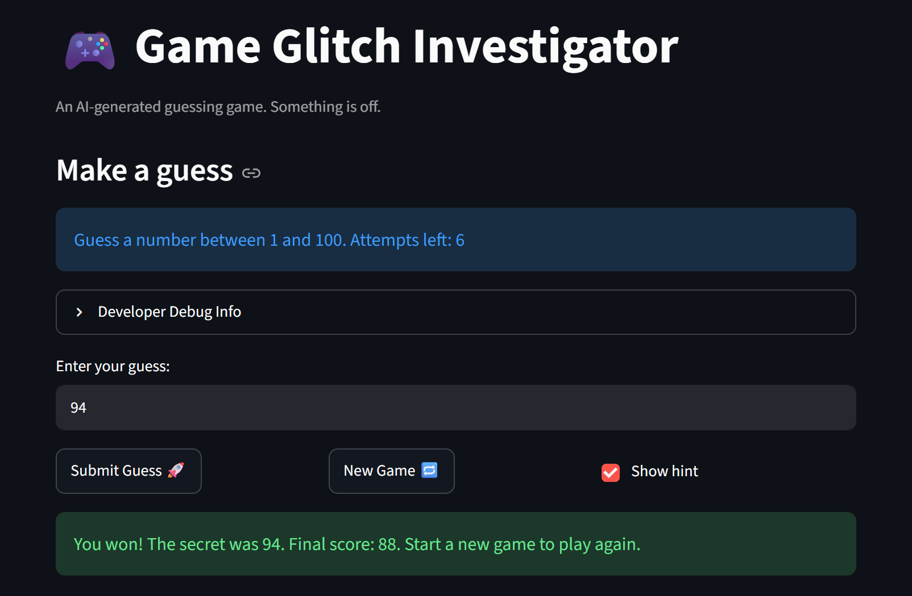

# 🎮 Game Glitch Investigator: The Impossible Guesser

## 🚨 The Situation

You asked an AI to build a simple "Number Guessing Game" using Streamlit.
It wrote the code, ran away, and now the game is unplayable. 

- You can't win.
- The hints lie to you.
- The secret number seems to have commitment issues.

## 🛠️ Setup

1. Install dependencies: `pip install -r requirements.txt`
2. Run the broken app: `python -m streamlit run app.py`

## 🕵️‍♂️ Your Mission

1. **Play the game.** Open the "Developer Debug Info" tab in the app to see the secret number. Try to win.
2. **Find the State Bug.** Why does the secret number change every time you click "Submit"? Ask ChatGPT: *"How do I keep a variable from resetting in Streamlit when I click a button?"*
3. **Fix the Logic.** The hints ("Higher/Lower") are wrong. Fix them.
4. **Refactor & Test.** - Move the logic into `logic_utils.py`.
   - Run `pytest` in your terminal.
   - Keep fixing until all tests pass!

## 📝 Document Your Experience

- [ ] Describe the game's purpose.
- [ ] Detail which bugs you found.
- [ ] Explain what fixes you applied.

The game's purpose is to guess the secret number within the number of attempts given to the user. The number of attempts and the secret number depends on 
the level of difficulty picked by the user. The user also gets hints that helps them get closer to the correct answer. One of the bugs that I found was 
that the specific ranges of the difficulty levels were not being used. It was instead hardcoded for the secert number to be in between 1 and 100 and it 
also always showed that the range was 1 to 100 no matter the level the user picked. To fix this I made sure that the secret number was generated 
depending on the level and that the range was not hardcoded. Another bug was that the hints were incorrect and to fix this I looked at the logic behind 
the hints. When going through the conditional statement I realized that the hints were reversed. I made sure that the correct condition and the correct 
hint were placed together. Another bug was that the number of attempts was off by one becuase instead of getting 8 attempts I was only given 7 attempts 
even though I was told 8. To fix this I made sure that variable storing the attempts is initialized to 0 and only incremented by one when the user 
presses the submit guess button.  

## 📸 Demo Walkthrough

Describe your fixed game in numbered steps so a reader can follow along without watching a video:

1. Choose a difficuly level.
2. Make a guess that fits within the range of the difficulty level.
3. Submit your guess by pressing the Submit Guess button.
4. Use the hints to make another guess until you run out of attempts or correctly guess the secret number.
5. If you want to try again after running out of attempts press the New Game button.

**Screenshot** *(optional)*:


## 🧪 Test Results

```
================================================================ test session starts =================================================================
platform linux -- Python 3.12.3, pytest-9.1.1, pluggy-1.6.0 -- /home/jhonpaul62705/CodePath/Projects/ai110-module1show-gameglitchinvestigator-starter/.venv/bin/python3
cachedir: .pytest_cache
rootdir: /home/jhonpaul62705/CodePath/Projects/ai110-module1show-gameglitchinvestigator-starter
plugins: anyio-4.14.0
collected 43 items                                                                                                                                   

tests/test_game_logic.py::test_easy_range PASSED                                                                                               [  2%]
tests/test_game_logic.py::test_normal_range PASSED                                                                                             [  4%]
tests/test_game_logic.py::test_hard_range PASSED                                                                                               [  6%]
tests/test_game_logic.py::test_unknown_difficulty_defaults_to_normal_range PASSED                                                              [  9%]
tests/test_game_logic.py::test_all_difficulty_ranges_start_at_one PASSED                                                                       [ 11%]
tests/test_game_logic.py::test_all_difficulty_ranges_are_valid PASSED                                                                          [ 13%]
tests/test_game_logic.py::test_easy_range_narrower_than_normal PASSED                                                                          [ 16%]
tests/test_game_logic.py::test_hard_range_narrower_than_normal PASSED                                                                          [ 18%]
tests/test_game_logic.py::test_easy_secret_never_exceeds_20 PASSED                                                                             [ 20%]
tests/test_game_logic.py::test_hard_secret_never_exceeds_50 PASSED                                                                             [ 23%]
tests/test_game_logic.py::test_normal_secret_within_1_to_100 PASSED                                                                            [ 25%]
tests/test_game_logic.py::test_easy_secret_not_in_normal_only_range PASSED                                                                     [ 27%]
tests/test_game_logic.py::test_each_difficulty_generates_secrets_within_its_own_range PASSED                                                   [ 30%]
tests/test_game_logic.py::test_winning_guess PASSED                                                                                            [ 32%]
tests/test_game_logic.py::test_guess_too_high PASSED                                                                                           [ 34%]
tests/test_game_logic.py::test_guess_too_low PASSED                                                                                            [ 37%]
tests/test_game_logic.py::test_win_message_signals_correct PASSED                                                                              [ 39%]
tests/test_game_logic.py::test_win_message_has_no_direction_hint PASSED                                                                        [ 41%]
tests/test_game_logic.py::test_too_high_hint_says_lower PASSED                                                                                 [ 44%]
tests/test_game_logic.py::test_too_low_hint_says_higher PASSED                                                                                 [ 46%]
tests/test_game_logic.py::test_too_high_hint_does_not_say_higher PASSED                                                                        [ 48%]
tests/test_game_logic.py::test_too_low_hint_does_not_say_lower PASSED                                                                          [ 51%]
tests/test_game_logic.py::test_one_above_secret_says_lower PASSED                                                                              [ 53%]
tests/test_game_logic.py::test_one_below_secret_says_higher PASSED                                                                             [ 55%]
tests/test_game_logic.py::test_easy_attempt_limit PASSED                                                                                       [ 58%]
tests/test_game_logic.py::test_normal_attempt_limit PASSED                                                                                     [ 60%]
tests/test_game_logic.py::test_hard_attempt_limit_is_five PASSED                                                                               [ 62%]
tests/test_game_logic.py::test_hard_attempt_limit_not_four PASSED                                                                              [ 65%]
tests/test_game_logic.py::test_hard_fewer_attempts_than_normal PASSED                                                                          [ 67%]
tests/test_game_logic.py::test_hard_fewer_attempts_than_easy PASSED                                                                            [ 69%]
tests/test_game_logic.py::test_all_attempt_limits_are_positive PASSED                                                                          [ 72%]
tests/test_game_logic.py::test_new_secret_in_easy_range_after_reset PASSED                                                                     [ 74%]
tests/test_game_logic.py::test_new_secret_in_hard_range_after_reset PASSED                                                                     [ 76%]
tests/test_game_logic.py::test_new_secret_in_normal_range_after_reset PASSED                                                                   [ 79%]
tests/test_game_logic.py::test_check_guess_works_on_fresh_secret_after_reset PASSED                                                            [ 81%]
tests/test_game_logic.py::test_game_over_then_new_game_correct_guess PASSED                                                                    [ 83%]
tests/test_game_logic.py::test_game_over_then_new_game_hints_still_correct PASSED                                                              [ 86%]
tests/test_game_logic.py::test_new_secrets_for_all_difficulties_are_in_range PASSED                                                            [ 88%]
tests/test_game_logic.py::test_parse_valid_integer PASSED                                                                                      [ 90%]
tests/test_game_logic.py::test_parse_empty_string_rejected PASSED                                                                              [ 93%]
tests/test_game_logic.py::test_parse_none_rejected PASSED                                                                                      [ 95%]
tests/test_game_logic.py::test_parse_non_numeric_returns_error PASSED                                                                          [ 97%]
tests/test_game_logic.py::test_parse_float_string_truncates_to_int PASSED                                                                      [100%]

================================================================= 43 passed in 0.12s =================================================================
```

## 🚀 Stretch Features

- [ ] [If you choose to complete Challenge 4, describe the Enhanced UI changes here — a screenshot is optional]
